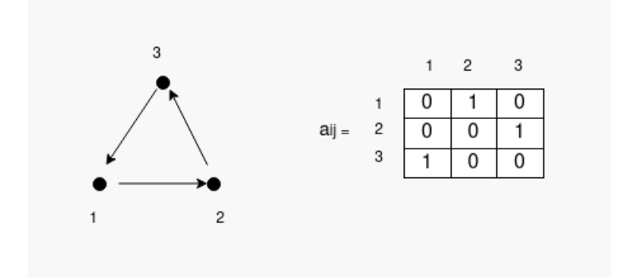

# Multi-robot systems: Controlling a Swarm using Consensus Protocol

### Multi-Robot systems course project

  

  

### Faculty of Electrical Engineering and Computing in Zagreb

  

  

### 2023./2024.

  

  

## [Download Docker simulator](https://github.com/larics/mrs_course)

  

  

## Start Docker Container

  

  

In one terminal copy/paste :

  

```sh
sudo  docker  start  -i  mrs_project_2
```

  

  

In other terminal copy/paste

  

```sh
sudo  docker  exec  -it  mrs_project_2  bash
```

  

  

your terminal prompt should change from

  

```bash
<your username>@<your hostname>
```

  

to

  

```bash
developer@<your  hostname>
```

  

This signals that you are currently "inside" the container.

  

  

## Clone and build the project

  

  

- Clone this project in: `~/catkin_ws/src`

  

  

```sh
git  clone  https://github.com/bornaparo/mrs_project2_simulation.git
```

  

  

- Build: `$: ~/catkin_ws/`

  

```sh
catkin  build
```

## Modification

Delete everything from `/home/developer/catkin_ws/src/sphero_simulation/sphero_stage/launch` directory and paste into it everything from `/home/developer/catkin_ws/src/mrs_project2_simulation/launch_for_sphero` directory

## Communication

Who can communicate with whom is defined as adjacency matrix in `.txt` file where elements in column are delimited by space, size of the matrix is `NxN` where `N` is the number of robots in the simulation. Row sends messages to column. For example, adjacency matrix:

```
0 1 0
0 0 1
1 0 0
```

Describes that first robot sends messages to the second, second sends messages to the third, and third sends messages to the first.  This formation is shown in image below:



## Formation

Formation is also defined in `.txt` file as matrix where columns are delimited by space. Size of the matrix is `Nx2` where `N` is the number of robots in simulation, number of columns is 2 which corresponds to the x and y coordinate of the i-th robot.

For example:
```
0 0
1 0
0.5 1
```
Defines that first robots will go to coordinates (0,0), second to (1,0) and third to (0.5,1) and they will form triangle (in this formation). Robots will keep relative distance between each other as defined in formation file, if the matrix in formation file has all zeros, robots will perform rendezvous and they will collide with each other.

**Note:** number of robots `N` needs to be the same in adjacency matrix and formation matrix
  
## Launch example

```
roslaunch mrs_project2_simulation empty_map_square_leader_launch.launch
```

If the leader exists (defined as parameter in launch file), you can set goal position which formation needs to achieve, for example:
 ```
 rosservice call /set_goal_position "x: 3.0
y: -3.0"
```


## Videos:

[Simple Maze Map Consensus protocol square formation](https://www.youtube.com/watch?v=mv3EmR-7Zrs)

[Consensus-based rendevouz1](https://www.youtube.com/shorts/ssQA6_Nb9PI)

[Consensus-based rendevouz2](https://youtube.com/shorts/6TzlM64vCuc?feature=share)

[Consensus-based line formation](https://youtube.com/shorts/OzZLvxYUej8?feature=share)

[Consensus-based square formation](https://youtube.com/shorts/9NSRjXCpGjU?feature=share)

[Consensus-based triangle formation](https://youtube.com/shorts/dGimMKKlx24?feature=share)

[Simple maze map consensus protocol triangle formation](https://youtube.com/shorts/ToSf7xnGgiQ?feature=share)

[Simple maze map consensus protocol line formation](https://youtube.com/shorts/CGm-xOgTmrs?feature=share)
